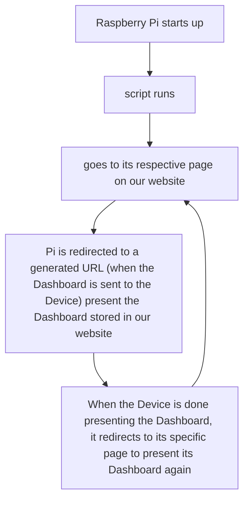

# How the Raspberry Pi's work with our website



## Instructions for setting up the development environment
# Nuxt 3 Minimal Starter

Look at the [Nuxt 3 documentation](https://nuxt.com/docs/getting-started/introduction) to learn more.


## Setup
Clone repsitory

Copy .env into root or fill out new keys from .env.example

Need Private keys/info for
  - Auth0
Make sure to install the dependencies:

```bash
# npm
npm install

# pnpm
pnpm install

# yarn
yarn install

# bun
bun install
```
## Initialie Database

Initialize Postgres DB via

- npx prisma generate
- npx prisma migrate dev
- npx prisma studio
Open the generated localhost:5555 if you aren't automatically taken to it
  - localhost:5555
Add yourself as a user

## Development Server

Start the development server on `http://localhost:3000`:

```bash
# npm
npm run dev

# pnpm
pnpm run dev

# yarn
yarn dev

# bun
bun run dev
```

## Production

Build the application for production:

```bash
# npm
npm run build

# pnpm
pnpm run build

# yarn
yarn build

# bun
bun run build
```

Locally preview production build:

```bash
# npm
npm run preview

# pnpm
pnpm run preview

# yarn
yarn preview

# bun
bun run preview
```

Check out the [deployment documentation](https://nuxt.com/docs/getting-started/deployment) for more information.
