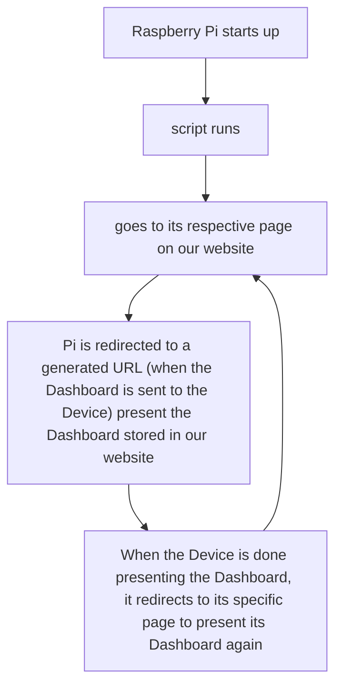

# Monitor Dashboard


## Project Background & Introduction
We want to create an easy-to-use and dependable dashboard web app that has an access control list, admin page, etc to add/remove users. It should have the capability to display images, videos, and web pages across monitors in SPN. It should store previously used "Dashboards" for future use. It will be able to manage attached devices (Raspberry Pi). It should display a list of active devices along with the name of the Dashboard assigned to them on their respective pages. It must allow for editing of existing Dashboards.

### Admin (has all functionality of users):
  
  - Ability to view all current users
  - Ability to add new users and admins
  - Ability to remove users
  - Ability to remove any dashboard
  - Ability to edit any dashboard                                         

### User:
  - Allow Users to edit their own Dashboard
  - Allow Users to view all Dashboards
  - Allow Users to delete their own dashboard
  - Allow User to go back to the home page
  - Allow User to make their own dashboard
  - Give Users option to edit their own dashboard
  - Users can edit the duration of the slide
  
## Functional Requirements

  ##### Admin Page
    - This page is only available to Admin
    - Allows admin to add Users
    - Allows Admin to see the current Users

  ##### Edit Dashboard Page
    - Page is available to users and admin
    - Ability to edit which dashboard you want to display
    - Page has Button for Edit, Other and Delete
    - Other Button can allow you to post, preview, and rename the dashboard if needed
      - Clicking post will redirect you to another page that will post the slide
      - Clicking preview will redirect you to another page, allowing to show you the link you entered to preview
      - Rename redirects users to a new page to enter a new name for the dashboard
    - Displays the Image, website, or URL that the  user wants to display on the page

  ##### Dashboard List Page
    - Allows users to add a dashboard
    - Allows users to delete the dashboards that users select
    - Displays button for Home, and Login if user needs to redirect back
    - Button that says back redirecting them to the last page
    - Page is available to users, not admins
    
  ##### Dashboard Page
    - This page is where it allows users and admins to present
    - Button to allow users to edit, if needed, to fix any errors they may have
    - Button to present to display on the monitors
    - Page is available to users and admin

  ##### Current-Users Page
    - Page is only available to admin
    - Page allows Admin to see the current users currently logged into the monitor dashboard
    - Admin has the ability to delete, add, and edit any given user


## Third-Party Integrations
  - Auth0, An API that allows for authentication, and users and admins to sign in saving their account on the webapp

# Tech Stack

  ##### Frontend Frameworks
        - Vue.js  (Frontend Java/Typescript Framework)
        - Tailwind CSS (Styling Framework)
        - Pug (HTML Styling)
  ##### Backend Frameworks
        - Nuxt.js(Framework for handling Backend)
  ##### Database
        - SQLite (Database)
        - Primsa (Helps write SQLite)
        
# How the Raspberry Pi's work with our website


## Instructions for setting up the development environment

## Setup
Clone repsitory

Copy .env into root or fill out new keys from .env.example

Need Private keys/info for
  - Auth0
Make sure to install the dependencies (node_modules):

```bash
# npm
npm install

# pnpm
pnpm install
```
## Initialize Database

Initialize SQLite3 DB via

- npx prisma generate
- npx prisma migrate dev
- npx prisma studio
Open the generated localhost:5555 if you aren't automatically taken to it
  - localhost:5555
Add first user with prisma studio with valid email that you can use

## Development Server
Start the development server on `http://localhost:3000`:
```bash
# npm
npm run dev
```
## Interacting with site
  - Log in via the 'Login' button after you are invited
